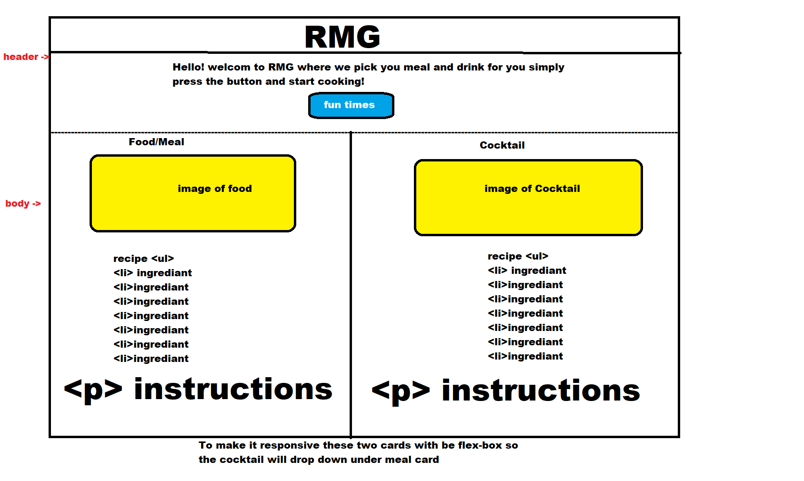
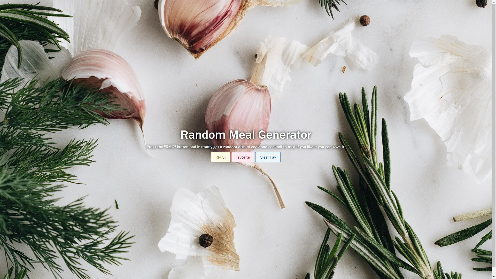
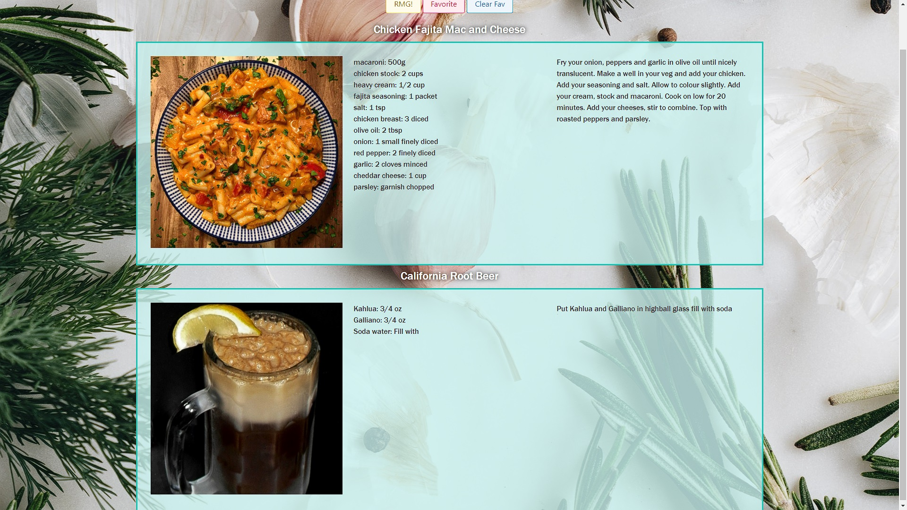
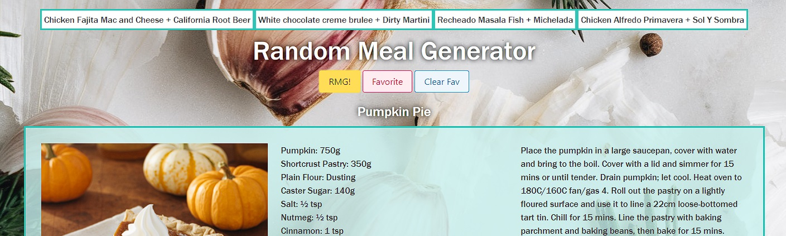

# Random Meal Generator

## Table of Contents
1. Introduction
2. Planning
3. Additions
4. Bugs
5. Future Plans
6. Conclusion

## Introduction

Hi! Welcome to our first team project. We had a lot of fun working together to accomplish the final product. Thank you for taking your time to look through our code and interface with the webpage.

[Here is a link to the Deployed website, check it out!](https://huirayj.github.io/random-meal-generator/)

The website is simple to understand and easy to use. Just press the RMG button to get your meal and drink. If you like it you can save it to favorites to use again. If you aren't pleased with your random meal, press RMG again. 

## Planning

Before we started building, we looked at all of the avaible API's to choose from. While we were discussing our ideas for each API, food seemed to be gaining more traction. We then put most of our brainstorming onto food. A conclusion was met. We wanted to help those who had no idea what they wanted to eat or drink by picking something completely random for them. We also wanted to help the user by giving them important information other than a name of a dish such as; ingredients, instructions, and an image of the dish/ drink they would make. 

After we attained a user story, the teams focus shifted to the layout of the website. 

This was the teams wireframe. It was clear, simple and clean. This wireframe was meant for the MVP. After we achieved the MVP we started to add more and change some of the layout.

## Additions 

Once we got the MVP set up and functioning, it was time to add more to our website. The first thing we decided on was a small change that added some complexity to our site and that was change the layout from verticle cards to horizontal displayed cards. 

Another addition was adding meals to a saved list if the user wanted to remake it in the future. We decided on making that list appear at the top above the header. To give a navigation bar feeling. And just incase the user wants to keep the feeling of something new, we gave them the option of clearing the saved list. 

The final major addition was to have the user be greeted with something very simple, just the header and the buttons. Once the RMG button is pressed the website loads back to the intended layout. 

## Bugs 

While building this website we ran into a couple of bugs. The biggest problem was the ampersand in dish names. For example "Fish & Chips". When we concatenated the two names it would say "Fish & Chips & Pina Colada". This is hard for JS to understand when we split the string to search the API, and also just looks really cluncky to read. We solved this by using "and" instead of the ampersand in the dish names, and a "+" when we concat.

## Future Plans

For the future of the website the team is looking to add some aesthetic with plans of potentially adding a logo. In the head of the webpage and somewhere in the body of the HTML as well, either in the footer or top corners. This would help in the future to have "RMG" be a recognizable image aswell.

Another addition the team wants to add is collapsibility in both the saved list, and in the recipe of the random meal. In some cases the team recognizes that the recipe is very long and dominates the webpage creating a harsh imbalance. Giving it the ability to colapse would restore this balance. The same can be said with the saved list, but mainly for mobile users. If the user has more than 5 Items saved that list will take up most of the screen's real estate.

## Conclusion

The team learned a lot while working on this webpage. We learned about communication, workflow, order of operations. Overall the team is very happy with the outcome and proud to put it on our portfolios. 

We wanted to thank you one more time for taking your time to look through everything, we greatly appreciate it.

- [Aaron](https://github.com/aaron-might), [Livak](https://github.com/Sand-ito), [Justin](https://github.com/huirayj)

## Screenshots
### Start of the site

### Site content

### Favorite list
